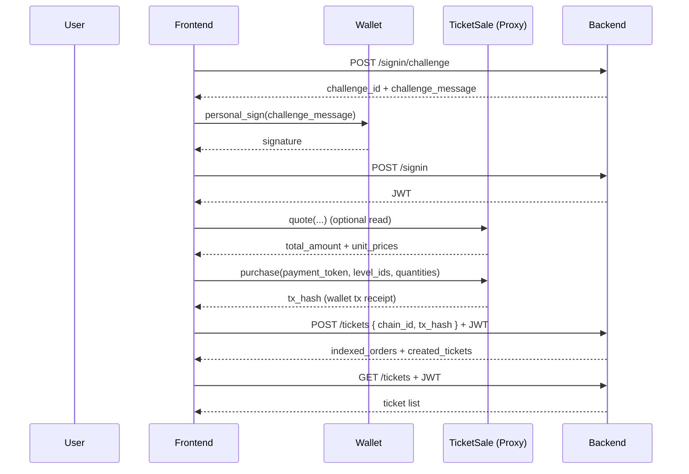

# Lili Ticket Frontend Integration Guide

本文档面向前端开发，目标是帮助你完成以下接入：

- 钱包登录（签名换 JWT）
- 链上购票（调用 `TicketSale` 透明代理）
- 通知后端同步链上订单（`chain_id + tx_hash`）
- 查询门票、查看门票详情
- 门票转赠（钱包地址 / 邮箱）

本文档是前端交付版本，重点强调「业务流程 + 接口约定 + 链上接入方式 + 常见坑」。

如果前端同学希望先快速联调，请优先阅读精简版：

- `backend/docs/frontend-quickstart.md`

## 1. 系统边界与职责

### 1.1 职责划分

- 智能合约：
  - 负责售票、收款、价格规则、事件记录（`TicketsPurchased`）
  - 不发 NFT / 不做链上票权转移
- 后端：
  - 负责登录鉴权（钱包签名 + JWT）
  - 索引链上购票事件到 DB
  - 维护票务归属（钱包 / 邮箱）
  - 维护二维码 payload（转赠后轮换）
- 前端：
  - 负责钱包连接、签名、交易发起、交易状态展示
  - 调用后端 API 进行票务管理

### 1.2 关键业务约束（前端必须理解）

- 门票不对应链上 token，票务信息以后端索引结果为准。
- 链上只记录购票事件；转赠是链下行为（后端更新票归属）。
- 二维码 payload 为长期有效字符串（直到该票再次转赠后被轮换）。
- 支持按链配置（当前目标：ETH / BSC；先 Anvil + 测试网）。
- 价格是配置项（含时间段价格），不需要前端自行计算业务规则。

## 2. 业务流程总览

### 2.1 主流程（购票）



### 2.2 转赠流程（链下）

- 转赠到钱包地址：
  - 前端调用 `PUT /tickets/:id`，传 `to_wallet`
  - 后端将原票标记为 `transferred_out`
  - 后端生成新票（新 `id`、新 `qr_payload`），归属新钱包
- 转赠到邮箱：
  - 前端调用 `PUT /tickets/:id`，传 `to_email`
  - 后端同样生成新票并归属邮箱
  - 后端发送邮件（包含二维码 payload）

注意：邮箱转赠不需要额外确认流程（当前版本）。

## 3. 前端接入建议（按页面/模块）

### 3.1 登录模块（Wallet Sign-In）

前端需要实现两步：

1. 获取 challenge：

```http
POST /signin/challenge
Content-Type: application/json

{
  "address": "0x..."
}
```

2. 钱包签名后换 JWT：

```http
POST /signin
Content-Type: application/json

{
  "address": "0x...",
  "challenge_id": "uuid",
  "signature": "0x..."
}
```

签名要求：

- 使用 `personal_sign` / EIP-191 语义（后端按 personal message 恢复地址）
- 必须签名后端返回的原始 `challenge_message`，不要前端自行改写内容

JWT 使用建议：

- 存内存优先；若需持久化，使用浏览器安全存储策略（视业务安全等级）
- 后续请求加：

```http
Authorization: Bearer <jwt>
```

### 3.2 售票页（链上交互）

前端链上交互使用：

- **代理地址（Proxy address）**
- ABI 使用 `TicketSale` 实现合约 ABI（对 proxy 地址调用）

常用只读方法（推荐接入）：

- `currentPrice(uint8 level_id)`：获取某档当前价格
- `quote(uint8[] level_ids, uint256[] quantities)`：获取订单报价（总价 + 单价列表）
- `getPriceSchedule(uint8 level_id)`：如需展示时间段价格
- `payment_tokens(token)`：如需校验某支付 token 是否启用（可选）

常用写方法：

- `purchase(address payment_token, uint8[] level_ids, uint256[] quantities)`

前端下单前建议：

1. 调用 `quote` 展示预计总价
2. 检查用户 token allowance（USDT/USDC）
3. 如 allowance 不足，先发 `approve`
4. 再发 `purchase`
5. 等交易 receipt
6. 调用后端 `POST /tickets` 同步票务

### 3.3 票夹页（Ticket List / Detail）

- `GET /tickets`：查询当前钱包的有效票（`status = active`）
- `GET /tickets/:id`：查询某张票详情

关键字段解释：

- `id`：后端票 ID（UUID），不是链上 tokenId
- `order_id`：链上事件里的订单号（合约 `next_order_id` 对应）
- `owner_wallet` / `owner_email`：票当前归属
- `qr_payload`：入场二维码内容（字符串）
- `qr_version`：当前二维码版本（转赠后会轮换）

### 3.4 转赠页（Transfer）

接口限制：

- `PUT /tickets/:id`
- `to_wallet` 和 `to_email` **二选一**，不能同时传，也不能都不传

示例（转赠到钱包）：

```json
{
  "to_wallet": "0x..."
}
```

示例（转赠到邮箱）：

```json
{
  "to_email": "receiver@example.com"
}
```

前端交互建议：

- 转赠成功后，使用接口返回的新票对象刷新 UI
- 原票会从当前用户有效票列表消失（已变为 `transferred_out`）

## 4. 后端 API 接入（前端视角）

OpenAPI 源文件：

- `backend/docs/openapi.yaml`

下面给出前端常用 API 摘要（以实现层行为为准）。

### 4.1 Auth APIs

#### `POST /signin/challenge`

用途：

- 创建一次性登录 challenge（短 TTL）

请求：

```json
{
  "address": "0x1111111111111111111111111111111111111111"
}
```

响应（200）：

```json
{
  "challenge_id": "uuid",
  "challenge_message": "Sign-In\nPurpose: Sign in to the ticketing service.\nSafety: This signature does not create a blockchain transaction and does not cost gas.\nWallet: 0x1111111111111111111111111111111111111111\nNonce: ...\nIssuedAt: 1730000000\nExpiresAt: 1730000300",
  "expires_at": 1730000000
}
```

#### `POST /signin`

用途：

- 校验签名并签发 JWT

请求：

```json
{
  "address": "0x1111111111111111111111111111111111111111",
  "challenge_id": "uuid",
  "signature": "0x..."
}
```

响应（200）：

```json
{
  "wallet": "0x1111111111111111111111111111111111111111",
  "token": "jwt-token",
  "expires_at": 1739999999
}
```

### 4.2 Ticket APIs

#### `GET /tickets`

用途：

- 查询当前 JWT 所属钱包的有效票列表

响应（200）：

- `TicketView[]`

#### `POST /tickets`

用途：

- 通知后端根据 `chain_id + tx_hash` 拉取链上事件并入库

请求：

```json
{
  "chain_id": 11155111,
  "tx_hash": "0x..."
}
```

响应（200）：

```json
{
  "indexed_orders": 1,
  "created_tickets": 2
}
```

常见错误：

- `400`：交易中没有可解析的购票事件
- `403`：当前 JWT 钱包与事件 `buyer` 不匹配
- `401`：未登录/Token 无效

当前实现注意事项（重要）：

- 当该交易已被后台 indexer 提前索引时，`POST /tickets` 可能返回 `403`（因为当前路由层把“无匹配可新增结果”与“buyer 不匹配”收口了）
- 对前端而言，如果你确认订单已在票夹中出现，可以视为“已同步成功”
- 更稳妥做法：
  - `POST /tickets` 后立即 `GET /tickets`
  - 或直接轮询 `GET /tickets` 直到新票出现

#### `GET /tickets/:id`

用途：

- 查询单张有效票详情（仅当前钱包可见）

#### `PUT /tickets/:id`

用途：

- 链下转赠门票，并返回新的有效票对象

约束：

- `to_wallet` / `to_email` 必须二选一

## 5. 智能合约接入方法（前端）

### 5.1 地址与 ABI

前端需要关注三个信息：

- `chainId`
- `TicketSale proxy address`
- `TicketSale ABI`

说明：

- 当前采用 **Transparent Proxy** 模式
- 前端调用目标地址应为 **proxy address**
- ABI 使用 `TicketSale.sol` 的 ABI（业务函数都在实现合约定义）

### 5.2 关键事件：`TicketsPurchased`

后端索引依赖该事件，前端也可在 receipt 中读取做即时反馈。

事件字段（简化）：

- `order_id`
- `buyer`
- `payment_token`
- `total_amount`
- `level_ids`
- `quantities`
- `unit_prices`
- `purchased_at`

前端建议：

- 交易成功后拿 `tx_hash`
- 直接调用后端 `POST /tickets`
- 不要在前端自行“构造票”，以免与后端索引结果不一致

### 5.3 价格与精度

- USDT / USDC 常见为 `6` decimals（本地 mock 也是 `6`）
- 合约事件中的价格/金额以整数返回（字符串形式进入后端 API 响应）
- 前端展示时自行做 decimal 格式化

### 5.4 错误处理（合约侧）

前端会遇到的常见 revert 场景：

- `UnsupportedPaymentToken`
- `PriceScheduleMissing`
- `PriceNotStarted`
- `ZeroQuantity`
- `MismatchedOrderInputLength`
- `EnforcedPause`（暂停状态）

前端建议：

- 对已知错误做友好提示
- 记录 `chainId / txHash / wallet / selected levels / quantities` 便于排查

## 6. 数据一致性与时序问题（前端要处理）

### 6.1 `notify` 与后台 indexer 并行

后端存在两条索引路径：

- 主动通知：`POST /tickets`
- 后台轮询 indexer

两条路径是幂等设计（DB 唯一键约束 + 去重逻辑），但前端会观察到以下现象：

- `notify` 前票已出现（后台先索引）
- `notify` 返回 403，但 `GET /tickets` 能看到票（当前实现行为）

前端处理建议：

- 购买完成后执行以下策略之一：
  - 策略 A（推荐）：`notify` -> `GET /tickets` 校验结果
  - 策略 B：直接轮询 `GET /tickets`（适合你们后端 indexer 轮询较快）

### 6.2 Reorg / Confirmations

后端 indexer 已考虑：

- confirmations 截断
- reorg 检测与回滚重放

前端影响：

- 测试网若 `confirmations > 0`，票出现会有延迟（按链配置）
- 本地 Anvil 通常为 `0`，几乎实时

## 7. 前端状态管理建议（实践向）

### 7.1 建议的最小状态切分

- `auth`
  - wallet address
  - jwt token
  - token expires_at
- `purchase`
  - selected levels/quantities
  - quote result
  - tx hash
  - tx status
  - notify status
- `tickets`
  - ticket list
  - detail cache by id

### 7.2 购买按钮推荐状态机

- `idle`
- `approving`（如需要）
- `purchasing`
- `waiting_receipt`
- `notifying_backend`
- `refreshing_tickets`
- `done`
- `failed`

这样可以避免“交易成功但票未出现”时用户误判失败。

## 8. 联调与测试环境建议

### 8.1 本地联调（已提供脚本）

启动环境：

```bash
./scripts/dev-up.sh
```

用户侧模拟脚本（用于快速验证前端期望行为）：

```bash
./scripts/user-flow.sh help
./scripts/user-flow.sh flow
```

停止环境：

```bash
./scripts/dev-down.sh
```

### 8.2 前端联调最常用验证清单

1. 钱包登录成功，JWT 正常附带到后续请求
2. `quote` 与 UI 展示总价一致
3. `purchase` 成功后，`notify` + `list` 能看到新票
4. 转赠到邮箱后，原票从当前钱包消失
5. 转赠到钱包地址后，返回的新票 `owner_wallet` 正确
6. 后端返回错误时，UI 有明确提示（而非静默失败）

## 9. 上线前需要前后端确认的接口清单（建议）

以下信息建议在前端上线前固化到配置中心或环境文件：

- 每条链的 `chainId`
- 每条链的 `TicketSale proxy address`
- 支付 token 地址（USDT / USDC）
- 后端 API Base URL
- 后端是否启用邮件发送（邮箱转赠体验）
- 后端 `confirmations` 配置（影响票出现延迟）

## 10. 附录：前端伪代码示例

### 10.1 登录

```ts
const challenge = await api.post("/signin/challenge", { address });
const signature = await walletClient.signMessage({
  account: address,
  message: challenge.challenge_message,
});

const signin = await api.post("/signin", {
  address,
  challenge_id: challenge.challenge_id,
  signature,
});

setJwt(signin.token);
```

### 10.2 购票后同步

```ts
const txHash = await writeContractAsync({
  address: saleProxyAddress,
  abi: ticketSaleAbi,
  functionName: "purchase",
  args: [paymentToken, levelIds, quantities],
});

await waitForTransactionReceipt({ hash: txHash });

try {
  await api.post(
    "/tickets",
    { chain_id: chainId, tx_hash: txHash },
    { headers: { Authorization: `Bearer ${jwt}` } }
  );
} finally {
  // Even if notify fails, refresh list to handle "already indexed by backend indexer" case.
  await refetchTickets();
}
```

---

如需更完整字段定义，请直接参考：

- `backend/docs/openapi.yaml`
- `contracts/src/TicketSale.sol`
